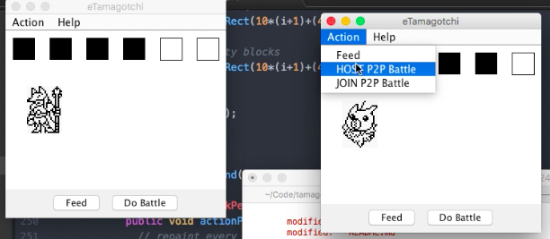
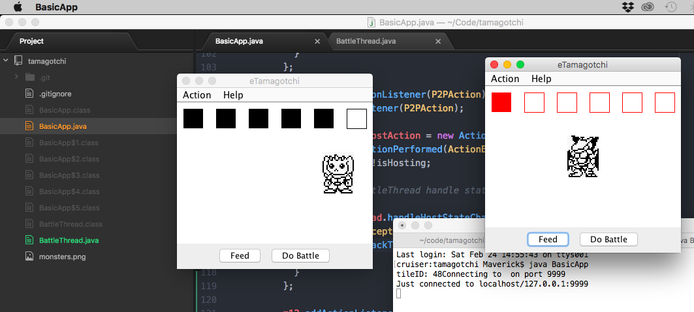
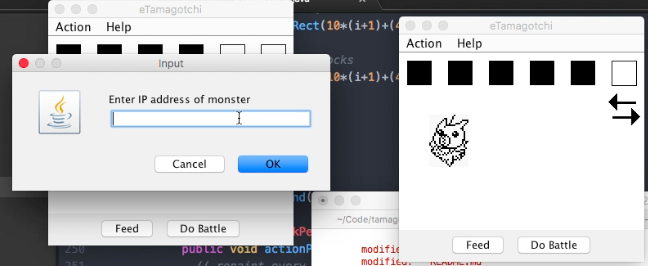
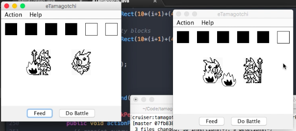

# eTamagotchi
## Author
Maverick Peppers "TheMaverickProgrammer"

## License
MIT commercial free use - open source means you can take, edit, and contribute

## Language
Android SDK is the development kit you'll be dealing with, and with source compatibility you'll use Java 6, 7 or 8.

See whichone you have installed using `java -version`

On **Mac OS** you can see all installed java version using `/usr/libexec/java_home -V`

Set the java version you want to use in your `.bash_profile` like so:

```
# NOTE: Leave one export command uncommented. Comment the rest.
# Java 1.9
export JAVA_HOME=$(/usr/libexec/java_home -v 9)

# Java 1.8
export JAVA_HOME=$(/usr/libexec/java_home -v 1.8)

# Java 1.7
export JAVA_HOME=$(/usr/libexec/java_home -v 1.7)

# Java 1.6
export JAVA_HOME=$(/usr/libexec/java_home -v 1.6)
```

## Compiling

### Desktop
`javac eTamagotchi.java`

`java eTamagotchi`

Doesn't get any simpler than that

### Android
Follow [this tutorial](https://www.apriorit.com/dev-blog/233-how-to-build-apk-file-from-command-line) to install Android build tools.

For easier development, set your Environment variables. For unix based machines, edit the `.bash_profile` in your user's root directory. Include paths for JAVABIN, ANDROID_SDK/tools, and ANDROID_SDK/platform-tools.

Here's what my `.bash_profile` looks like:

```
export JAVA_HOME=/Library/Java/JavaVirtualMachines/jdk1.8.0_131.jdk/Contents/Home
export JAVABIN=${JAVA_HOME}/bin
export ANDROID_SDK=/Users/Maverick/Library/Android/sdk
export PATH=${JAVABIN}:$ANDROID_SDK/tools:$ANDROID_SDK/platform-tools:$PATH
```

#### Signing an Android App
Keystores are not included in the repo. You'll need to create your own keystore to sign the app [here](https://stuff.mit.edu/afs/sipb/project/android/docs/tools/building/building-cmdline.html). Keystores must reside in the same folder as your project.

From your terminal in the android folder, run the keygen command:

`${JAVABIN}/bin/keytool  -genkey -v -keystore  etamagotchi-release-key.keystore -alias etamagotchi  -keyalg RSA -keysize 2048  -validity 10000
`

Remember to store your password somewhere or you can't sign your apps.

## Description
Inspired by Digimon "Digivices" tamagotchis circa 1990's. A good foundation for a more advanced virtual tamagotchi or "learning" material.

# Features
* A random digimon tile is selected and random stats are generated.

* eTamagotchi runs as both a host (timeout=60 seconds) and a client depending on the menu item selected.


* The digimon moves side to side when healthy (HP > 1)


* P2P battles.


* Battles are computed similarly to the originals: one of the devices
decides who would win before the effects took place on screen. The battles were simulated.
For eTamagotchi, the Host requests stat data from the Client and simulates
a battle by reducing each monsters stats by eachother's attack power at the same time.
Whoever has the most before K.O. wins. The client is updated with HP from the resulting battle.


* View stats from toolbar


# Room For Improvement
Lots of it. I hacked this together in 8 hours.

## Code Improvement
* The logic is in the main thread which happens to be the render loop. Bad.
Decouple the rendering from the main thread.

* Create a Monster class that represents the stats, tileID, and pass that back
and forth the BattleThread and the Render instances instead of how I'm doing it.
Divide the BattleThread into two different classes HostBattleThread and ClientBattleThread.

* Too many battle flags managing the thread states... speaking of threads...

* Unsure of the thread saftey. Each time a host or client is established a new thread is made. This can't be good.

* Creating new graphics each render call in P2P for opponent has to go

## Gameplay Improvement
* Read from a source the correct digimon names, stats, etc...

* Save the tamagotchi state data to a file and load

* Reward battling monsters with EXP points (e.g. winners +3 EXP, losers +1 EXP)

* Decrease health after X hours to reinforce feeding

* Add mood (hidden) stat

* 💩

* Evolution trees

* Animations
